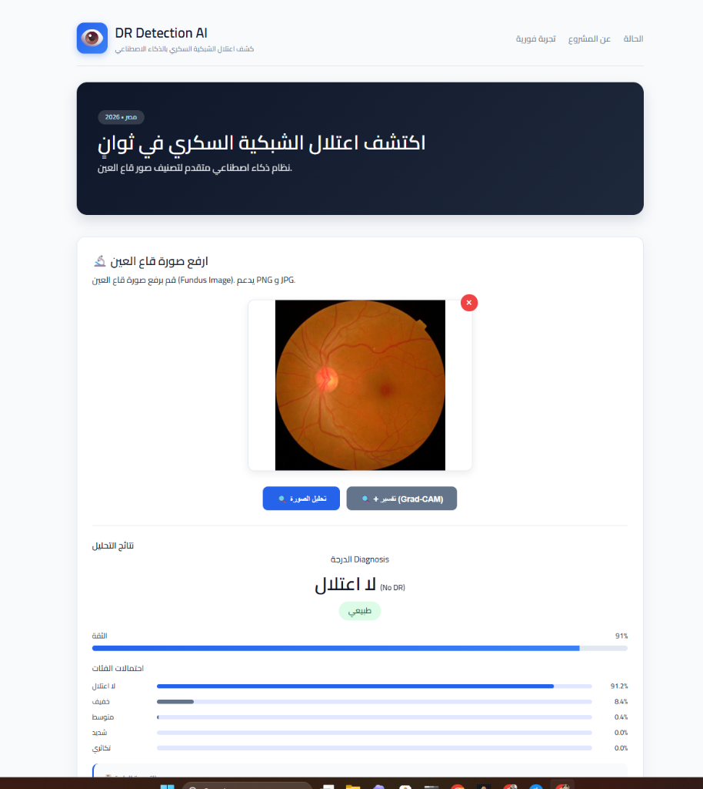
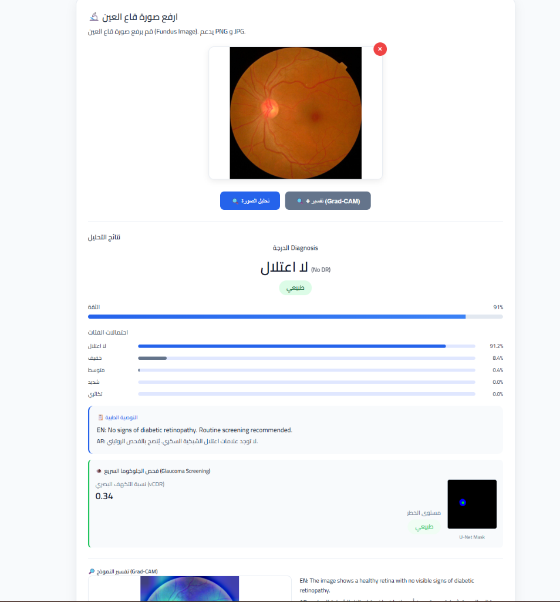
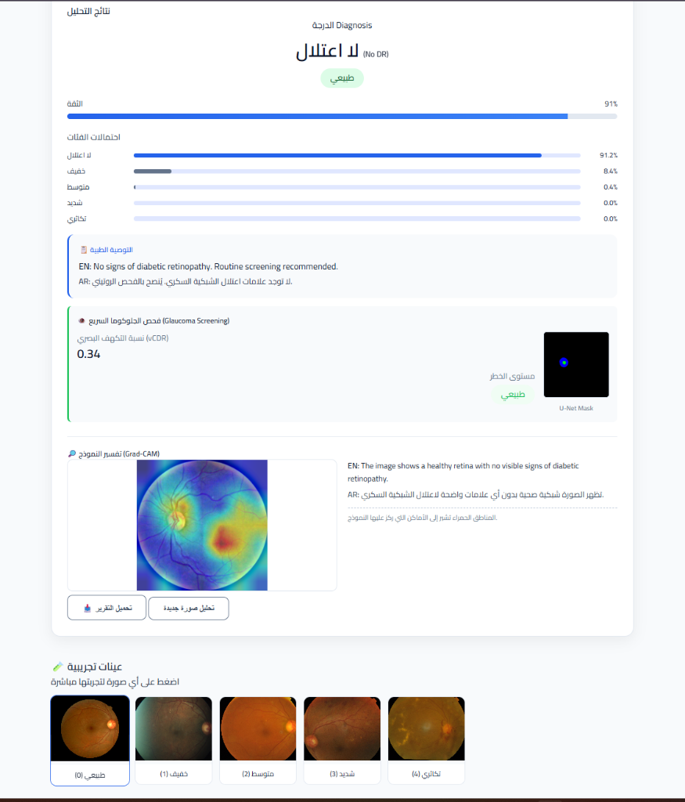
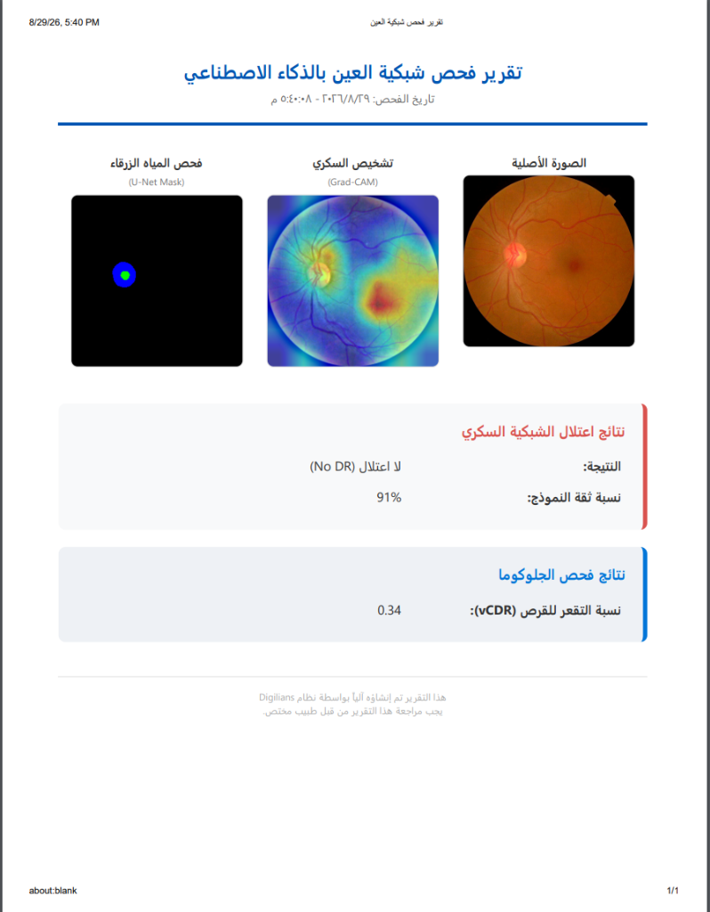
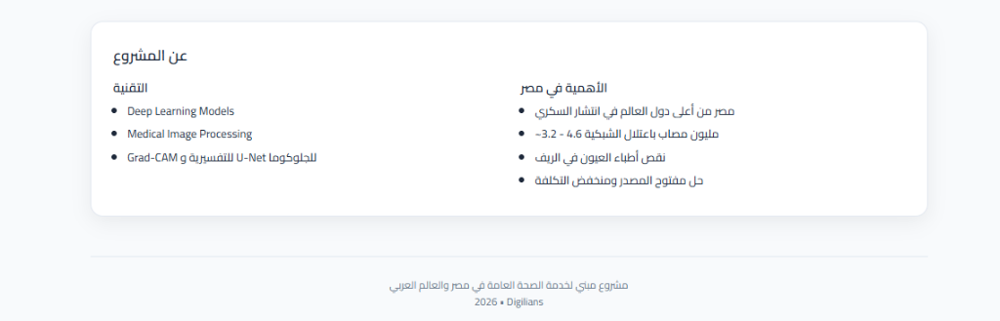
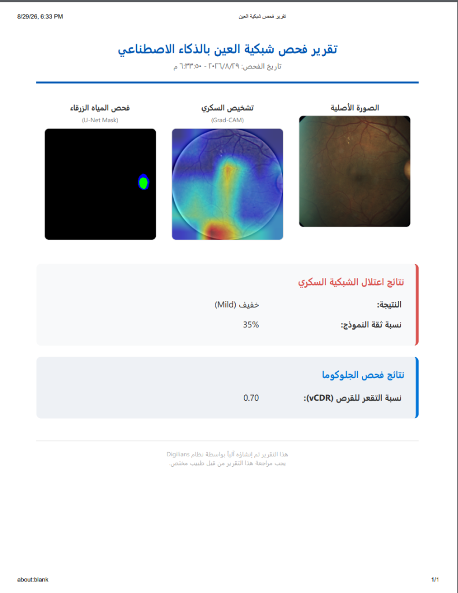
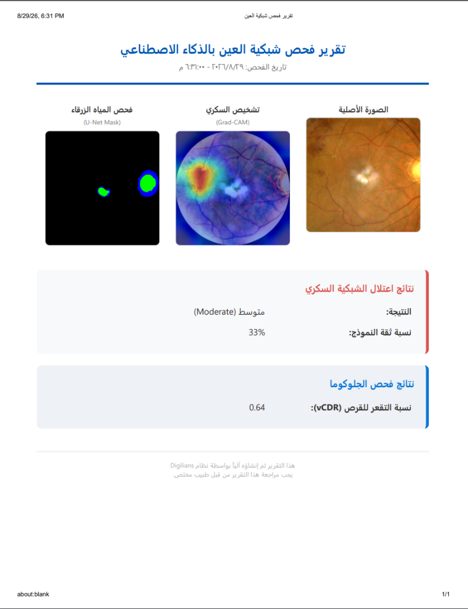
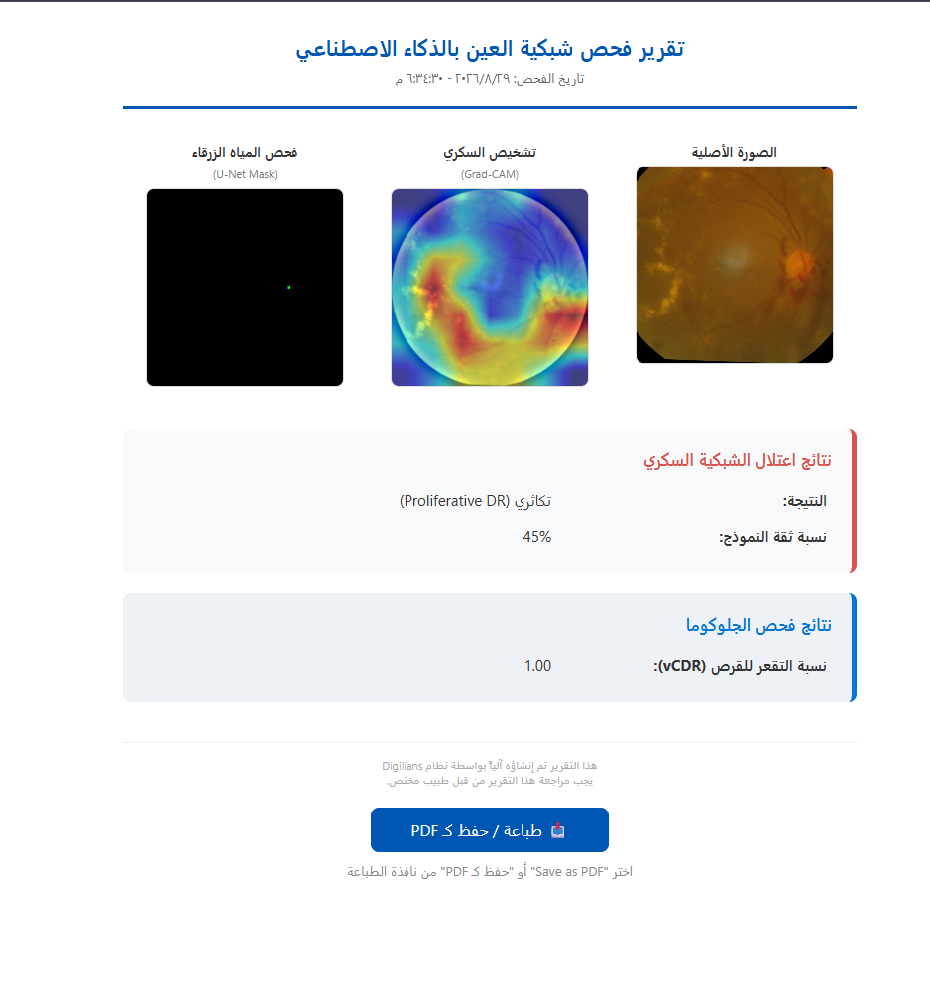

<div align="center">
  <h1>👁️ Diabetic Retinopathy & Glaucoma Detection AI</h1>
  <p><i>نظام ذكاء اصطناعي طبي متكامل لتشخيص اعتلال الشبكية السكري وفحص المياه الزرقاء (الجلوكوما) من صور قاع العين</i></p>
  <p><i>A comprehensive, production-ready AI pipeline & web platform for automated fundus image screening</i></p>
  
  <p>
    <a href="https://diabetic-retinopathy-model--ahmedzogly26.replit.app/dr-app/" target="_blank">
      
    </a>
  </p>
  
  <p>
    
    
    
    
    
    
    
  </p>

  <p>
    🔗 <b>رابط المنصة المباشرة (Cloud Live App):</b> <a href="https://diabetic-retinopathy-model--ahmedzogly26.replit.app/dr-app/">https://diabetic-retinopathy-model--ahmedzogly26.replit.app/dr-app/</a>
  </p>
</div>

<br>

---

## 🌐 التجربة الحية على السحابة (Live Web Demo)

يمكنك تجربة النظام مباشرة وفحص صور قاع العين واستخراج التقارير الطبية دون الحاجة إلى تثبيت أي برامج محلياً من خلال الرابط التالي:
👉 **[اضغط هنا لفتح التطبيق السحابي المباشر (Cloud Live Demo)](https://diabetic-retinopathy-model--ahmedzogly26.replit.app/dr-app/)**

---

## 📸 معرض واجهة المستخدم وسير العمل (Application Interface & Workflow)

يوفر النظام واجهة مستخدم ويب حديثة وسلسة باللغتين العربية والإنجليزية، تدعم التحليل الفوري لصور قاع العين مع تقارير طبية قابلة للطباعة:

---

### 1. واجهة الفحص والرفع (Hero Section & Image Upload)
<div align="center">
  
</div>

* **الوصف (AR):** الواجهة الرئيسية تتيح للطبيب أو أخصائي العيون رفع صور قاع العين (`Fundus Images`) بصيغ متعددة (JPG / PNG) بالسحب والإفلات أو التحديد المباشر مع معاينة فورية للصورة قبل الفحص.
* **Description (EN):** The interactive landing screen allows ophthalmologists to drag-and-drop or select high-resolution retinal fundus images with instant visual preview prior to AI inference.

---

### 2. نتائج التشخيص السريري والتوصيات (Clinical Diagnostics & Probability Breakdown)
<div align="center">
  
</div>

* **الوصف (AR):** عرض دقيق لدرجة اعتلال الشبكية السكري (طبيعي / خفيف / متوسط / شديد / تكاثري) مع نسبة ثقة النموذج، وتوزيع احتمالي تفصيلي لجميع الدرجات، بالإضافة إلى التوصية الإكلينيكية المعتمدة والفحص السريع لمؤشر الجلوكوما ($vCDR$).
* **Description (EN):** Real-time severity classification across 5 clinical stages (No DR, Mild, Moderate, Severe, Proliferative) paired with model confidence bars, multiclass probability distributions, actionable clinical guidelines, and vertical Cup-to-Disc Ratio ($vCDR$).

---

### 3. التفسيرية البصرية بالذكاء الاصطناعي وفحص الجلوكوما (Explainable AI & Glaucoma Segmentation)
<div align="center">
  
</div>

* **الوصف (AR):** 
  * **الخريطة الحرارية التفسيرية (Grad-CAM):** تبرز المناطق الدقيقة في الشبكية والأوعية الدموية التي استند إليها النموذج في اتخاذ القرار الطبي.
  * **تقطيع القرص والتقعر البصري (U-Net Segmentation Mask):** استخراج دقيق للقرص البصري (Optic Disc) والتقعر (Optic Cup) لحساب نسبة الجلوكوما بدقة.
  * **عينات تجريبية:** شريط سفلي يتيح اختبار عينات فورية مصنفة مسبقاً لجميع درجات المرض بنقرة واحدة.
* **Description (EN):** Highlights critical retinal regions and microvascular lesions via **Grad-CAM heatmaps**, generates semantic segmentation masks for the Optic Disc & Cup using **U-Net**, and offers one-click preloaded demo benchmark samples.

---

### 4. التقرير الطبي المعتمد الجاهز للطباعة والـ PDF (Automated Medical PDF Report)
<div align="center">
  
</div>

* **الوصف (AR):** توليد تقرير طبي رسمي متكامل بنقرة واحدة، يجمع الصورة الأصلية وخريطة Grad-CAM وقناع U-Net مع تفاصيل التشخيص الثنائية (عربي/إنجليزي)، مصمم للطباعة المباشرة وحفظه كملف `PDF` عالي الجودة لملفات المرضى.
* **Description (EN):** Generates an instant, publication-quality bilingual medical report displaying the input fundus image, explainability heatmaps, segmentation masks, and clinical findings, fully printable and downloadable as a PDF.

---

### 5. خلفية المشروع والأثر الصحي (Project Impact & Clinical Significance)
<div align="center">
  
</div>

* **الوصف (AR):** تسليط الضوء على الأهمية المجتمعية والطبية للمشروع، خاصة في مصر والعالم العربي لمواجهة نقص أطباء العيون في المناطق النائية وتقليل مخاطر فقدان البصر الناتج عن مضاعفات السكري.
* **Description (EN):** Contextual overview highlighting the technological foundation (Deep Learning, U-Net, Grad-CAM) and the socioeconomic healthcare impact in addressing diabetic complications and ophthalmologist shortages.

---

## 📑 عينات من تقارير الفحص لمختلف درجات المرض (Clinical Case Reports across Stages)

يستعرض هذا القسم نماذج حقيقية لتقارير الفحص الصادرة من النظام لمختلف مراحل اعتلال الشبكية السكري وفحوصات الجلوكوما المصاحبة:

| المرحلة السريرية (Stage) | تقرير الفحص الطبي الصادر (Generated Medical Report) | تفاصيل الحالة والمؤشرات الإكلينيكية (Clinical Details) |
|---|---|---|
| **خفيف (Mild DR)** |  | <ul><li>**التشخيص:** اعتلال شبكية خفيف (Mild DR)</li><li>**مؤشر الجلوكوما:** vCDR = 0.70</li><li>**التفسيرية:** تركيز خريطة Grad-CAM على التغيرات الوعائية الدقيقة الأولية.</li></ul> |
| **متوسط (Moderate DR)** |  | <ul><li>**التشخيص:** اعتلال شبكية متوسط (Moderate DR)</li><li>**مؤشر الجلوكوما:** vCDR = 0.64</li><li>**التفسيرية:** رصد بؤر ارتشاح ونزيف شبكي متوسط الوضوح مع قناع U-Net.</li></ul> |
| **تكاثري (Proliferative DR)** |  | <ul><li>**التشخيص:** اعتلال تكاثري متقدم (Proliferative DR)</li><li>**مؤشر الجلوكوما:** vCDR = 1.00</li><li>**التفسيرية:** انتشار واسع للأوعية الدموية غير الطبيعية والارتشاحات الحادة عبر كامل الشبكية.</li></ul> |

---

## ✨ المميزات الرئيسية (Key Features)

* 🧠 **Deep Learning Diagnosis:** مبني على نموذج **EfficientNet-B3** مع Transfer Learning على بيانات APTOS العالمية. محققاً نتائج فائقة: **Quadratic Weighted Kappa (QWK): 0.88**، ودقة عامة متقدمة.
* 🔍 **Explainable AI (Grad-CAM):** توفير شفافية كاملة للقرارات الطبية عبر الخرائط الحرارية لمساعدة الأطباء في التحقق من الآفات الشبكية.
* 👁️ **Glaucoma Screening ($vCDR$):** خوارزمية ذكية مدمجة مع شبكة تقطيع **U-Net** لحساب نسبة التقعر للقرص البصري وكشف مؤشرات المياه الزرقاء المبكرة.
* 📄 **Instant PDF Reports:** تصدير وطباعة تقارير طبية رسمية منسقة تدعم اللغة العربية والإنجليزية بجودة عالية.
* 🐳 **Production & Docker Ready:** تطبيق مهيأ بالكامل للنشر السحابي والمحلي عبر **Docker** و **FastAPI** بخفة وسرعة استجابة فائقة.

---

## 🔬 المعالجة الطبية للصور (Medical Preprocessing Pipeline)

لضمان أعلى دقة في التنبؤ، تمر كل صورة قاع عين بخطوات معالجة طبية صارمة:
1. **Dark Border Cropping:** إزالة الحواف السوداء غير المفيدة المحيطة بالصورة تلقائياً.
2. **Ben Graham's Method:** تطبيق Gaussian Blur معادل لتطبيع الإضاءة وإبراز التباين في الشعيرات الدموية والارتشاحات الدقيقة.

---

## 🛠️ حزمة التقنيات (Tech Stack)

* **Deep Learning:** PyTorch, Torchvision, PyTorch Grad-CAM, Segmentation Models
* **Computer Vision:** OpenCV, Albumentations, PIL, NumPy
* **Backend & API:** FastAPI, Uvicorn, Pydantic
* **Frontend:** Vanilla JavaScript, HTML5, Modern CSS (Responsive Glassmorphism & Medical Theme)
* **Reporting:** Native High-Fidelity Browser Print-to-PDF Pipeline
* **Deployment:** Docker, Uvicorn ASGI Server

---

## 🚀 طرق التشغيل (Getting Started)

### 1. التجربة السحابية المباشرة (Online Cloud Demo - No Setup Required)
أسرع طريقة لتجربة النظام مباشرة من أي جهاز أو هاتف ذكي:
🔗 **[https://diabetic-retinopathy-model--ahmedzogly26.replit.app/dr-app/](https://diabetic-retinopathy-model--ahmedzogly26.replit.app/dr-app/)**

### 2. التشغيل السريع باستخدام دوكر (Quick Start with Docker)
```bash
# 1. استنساخ المستودع (Clone Repo)
git clone https://github.com/ahmedzogly/Diabetic-Retinopathy.git
cd "Diabetic-Retinopathy/Diabetic Retinopathy/diabetic_retinopathy_project"

# 2. بناء حاوية الدوكر (Build Docker Image)
docker build -t diabetic-retinopathy-api .

# 3. تشغيل الحاوية (Run Container)
docker run -d -p 8000:8000 --name dr-api diabetic-retinopathy-api
```
🌐 التطبيق متاح محلياً عبر المتصفح: **[http://localhost:8000](http://localhost:8000)**

### 3. التشغيل المحلي المباشر على ويندوز (Windows One-Click Run)
ببساطة قم بالنقر المزدوج على ملف **`run_server.bat`** وسيقوم بتفعيل البيئة وفتح التطبيق في المتصفح تلقائياً.

---

## 📁 هيكل المشروع (Project Structure)

```text
Diabetic Retinopathy/
├── app/                  # تطبيق الويب وواجهة المستخدم
│   ├── static/           # ملفات CSS والتفاعل JS والصور التجريبية
│   ├── templates/        # قوالب HTML (index.html)
│   └── main.py           # خادم FastAPI ونقاط الـ API
├── docs/                 # التوثيق والصور المعمارية
│   └── screenshots/      # لقطات شاشة واجهة النظام ونماذج التقارير الطبية
├── src/                  # النماذج والمنطق الرياضي للذكاء الاصطناعي
│   ├── classifier_model.py # معمارية EfficientNet-B3
│   ├── explain.py        # محرك توليد خرائط Grad-CAM
│   ├── inference.py      # خط المعالجة والاستدلال الموحد
│   ├── segmentation_model.py # نموذج U-Net لتقطيع القرص والتقعر
│   └── cdr_calculator.py # حساب نسبة vCDR للجلوكوما
├── models/               # الأوزان المدربة (best_model.pth)
├── scripts/              # سكربتات التدريب والتقييم والاختبار
├── Dockerfile            # بناء بيئة الإنتاج الموحدة
├── requirements.txt      # الحزم والمتطلبات
└── run_server.bat        # تشغيل فوري وسريع للـ Backend محلياً
```

---

## 🎓 فريق العمل والإشراف (Team & Acknowledgements)

تم تطوير هذا النظام كمشروع تخرج تحت الإشراف الكريم للدكتور:
**Dr. Mohamed Elhadad** 👨‍🏫

**فريق التطوير والبحث (Development Team):**
* 👨‍💻 **Eslam Tag Elser**
* 👨‍💻 **Mohamed Hassan Ahmed**
* 👨‍💻 **Osama Mohamed Kamel**
* 👨‍💻 **Ahmed Zain Elabiden**
* 👨‍💻 **Ahmed Shehta Zoghli**

> *"مكرس لتطوير حلول رعاية صحية ذكية ومتاحة للجميع باستخدام الذكاء الاصطناعي مفتوح المصدر."*
